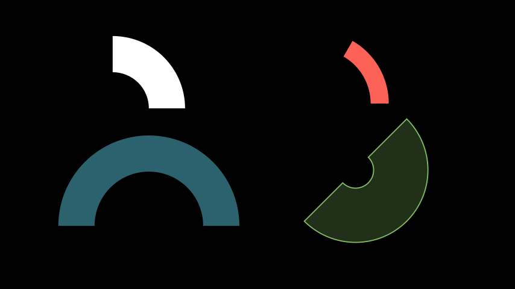

# AnnularSector
Adalah sektor bulatan

## Parameter
- **inner_radius** = jejari dalaman Sektor (default = 1)
- **outer_radius** = jejari luaran Sektor (default = 2)
- **angle** = sudut arah jam Sektor (default = `90*DEGREES`) (nilai negatif = lawan jam)
- **start_angle** = sudut permulaan arah jam Sektor (default = 0)
- **fill_opacity** = keterangan isi warna sektor (default = 1)
- **stroke_width** = ketebalan garis tepi Sektor (default =0)
- **color** = warna isi sektor (default = `WHITE`)


```python
from manim import *

class AnnularSectorExample(Scene):
    def construct(self):

        annu1 = AnnularSector().move_to([-3,2,0])

        annu2 = AnnularSector(
            inner_radius=1.5, outer_radius=2, angle=60*DEGREES, color=RED)

        annu3 = AnnularSector(
            inner_radius=1.5, 
            outer_radius=2.5, 
            angle=PI, 
            color = BLUE, 
            fill_opacity = 0.5)

        annu4 = AnnularSector(
            inner_radius = 0.5, 
            outer_radius = 2, 
            angle = -PI, 
            color = GREEN, 
            fill_opacity=0.25,
            stroke_width=3,
            start_angle=45*DEGREES)
        

        annu2.move_to([3,2,0])
        annu3.move_to([-3,-1,0])
        annu4.move_to([3,-1,0])

        self.add(annu1,annu2,annu3,annu4)
```


