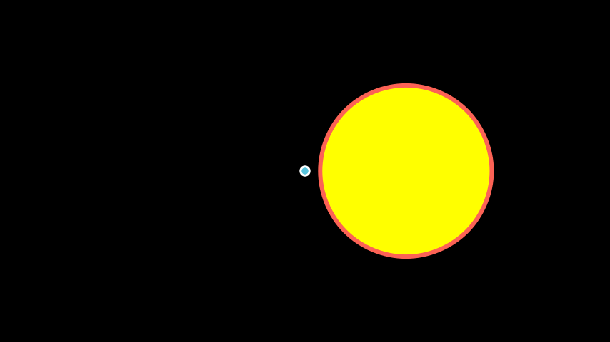

# Manim Community Edition (ManimCE)

# Senarai Contoh

## Dot
```python
from manim import *

class DotExample(Scene):
    def construct(self):
        # parameter point utk koordinate Dot (array)
        # parameter radius untuk saiz Dot (default = 0.08)
        dot1 = Dot(point=(-2,0,0), radius=0.1)
        # color untuk warna dot
        dot2 = Dot(point=ORIGIN, radius = 0.2, color=RED)
        dot3 = Dot(point=RIGHT)
        self.add(dot1,dot2,dot3)
```


## AnnotationDot
Dot yang lebih besar, ada isi berwarna, dan ada garis tepi

```python
from manim import *

class AnnotationDotExample(Scene):
    def construct(self):

        anno1 = AnnotationDot()
        # radius saiz dot (default = 1.3)
        # stroke_color warna garis tepi dot (default = WHITE)
        # fill_color warna isi dot (default = BLUE)
        # stroke_width saiz garis tepu (default = 5)
        anno2 = AnnotationDot(radius=2, stroke_color=RED, fill_color=YELLOW, stroke_width=10).next_to(anno1,RIGHT)


        self.add(anno1, anno2)
```


