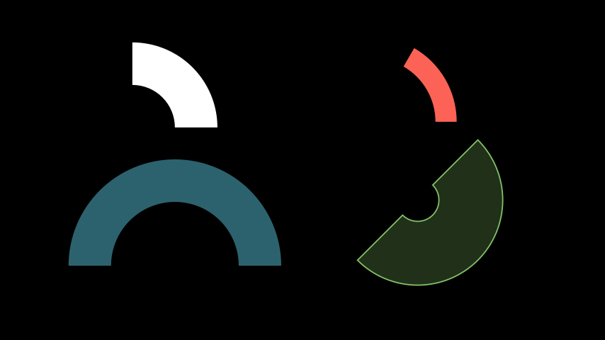

# Manim Community Edition (ManimCE)

___

# Senarai Contoh
- ## [Matriks](matrix.md)

___

# Dot
Dot adalah bulatan kecil

## Parameter
- **point** = koordinat dot dalam array `(x,y,z)` (default = `(0,0,0)`)
- **radius** = saiz dot (default = `0.08`)
- **color** = warna isi dot (default = `WHITE`)
- **stroke_width** = saiz garis tepi (default = `0`)
- **fill_opacity** = keterangan warna isi dot (default = `1.0`)

```python
from manim import *

class DotExample(Scene):
    def construct(self):
        dot1 = Dot(point=(-2,0,0), radius=0.1)
        dot2 = Dot(point=ORIGIN, radius = 0.2, color=RED)
        dot3 = Dot(point=RIGHT)
        self.add(dot1,dot2,dot3)
```


___

# AnnotationDot
Dot yang lebih besar, ada isi berwarna, dan ada garis tepi

## Parameter
- **radius** = saiz dot (default = 1.3)
- **stroke_color** = warna garis tepi dot (default = WHITE)
- **fill_color** = warna isi dot (default = BLUE)
- **stroke_width** = saiz garis tepu (default = 5)

```python
from manim import *

class AnnotationDotExample(Scene):
    def construct(self):

        anno1 = AnnotationDot()
        anno2 = AnnotationDot(radius=2, stroke_color=RED, fill_color=YELLOW, stroke_width=10).next_to(anno1,RIGHT)

        self.add(anno1, anno2)
```


___

# AnnularSector
Adalah sektor bulatan

## Parameter
- **inner_radius** = jejari dalaman Sektor (default = 1)
- **outer_radius** = jejari luaran Sektor (default = 2)
- **angle** = sudut arah jam Sektor (default = `90*DEGREES`) (nilai negatif = lawan jam)
- **start_angle** = sudut permulaan arah jam Sektor (default = 0)
- **fill_opacity** = keterangan isi warna sektor (default = 1)
- **stroke_width** = ketebalan garis tepi Sektor (default =0)
- **color** = warna isi sektor (default = `WHITE`)


```python
from manim import *

class AnnularSectorExample(Scene):
    def construct(self):

        annu1 = AnnularSector().move_to([-3,2,0])

        annu2 = AnnularSector(
            inner_radius=1.5, outer_radius=2, angle=60*DEGREES, color=RED)

        annu3 = AnnularSector(
            inner_radius=1.5, 
            outer_radius=2.5, 
            angle=PI, 
            color = BLUE, 
            fill_opacity = 0.5)

        annu4 = AnnularSector(
            inner_radius = 0.5, 
            outer_radius = 2, 
            angle = -PI, 
            color = GREEN, 
            fill_opacity=0.25,
            stroke_width=3,
            start_angle=45*DEGREES)
        

        annu2.move_to([3,2,0])
        annu3.move_to([-3,-1,0])
        annu4.move_to([3,-1,0])

        self.add(annu1,annu2,annu3,annu4)
```


